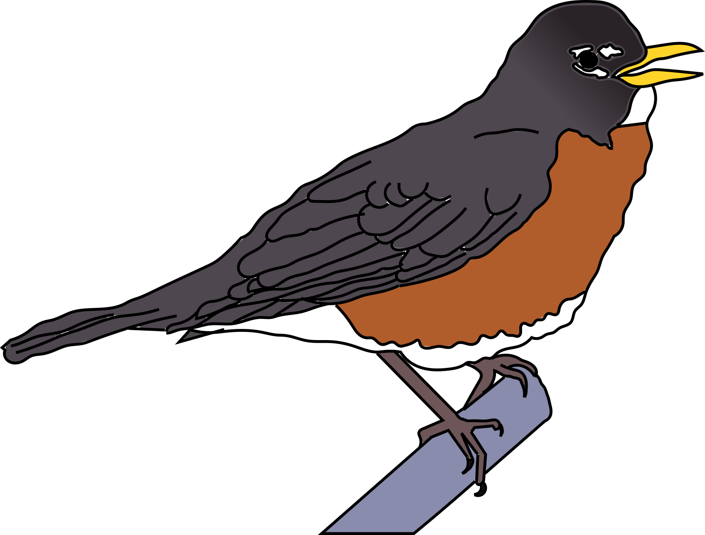
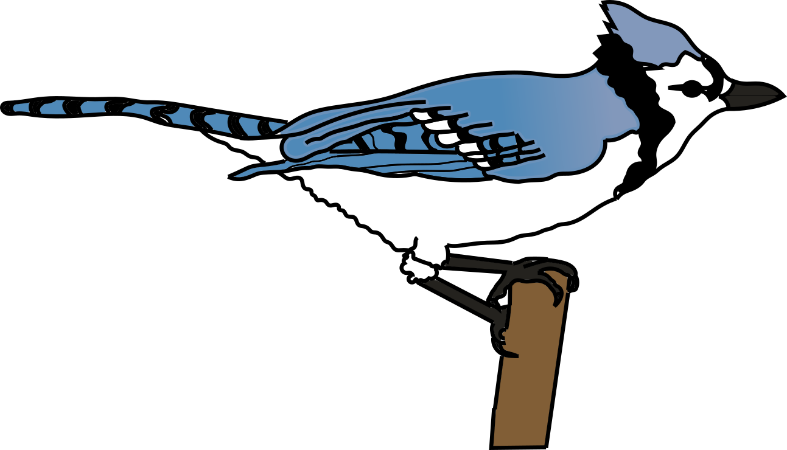
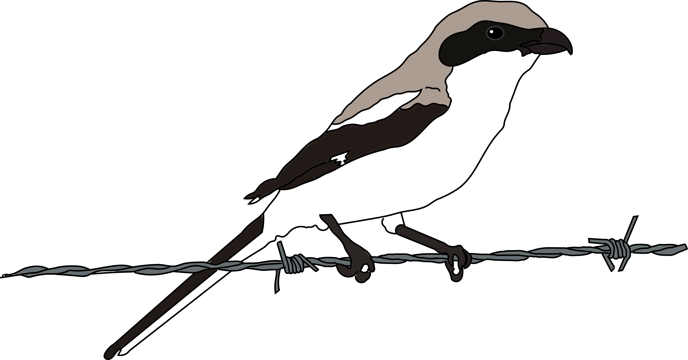
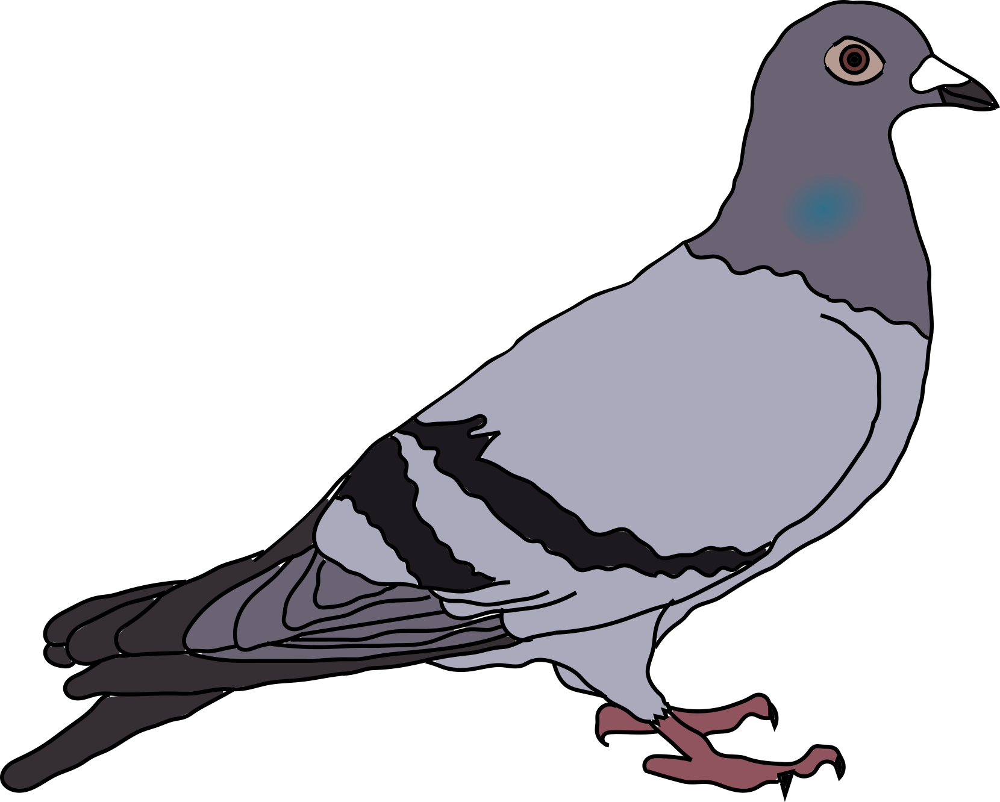

<div align="center"> <h3>Metadata for: Strolling through a century: replicating historical bird surveys to explore 100 years of change in an urban bird community</h2> </div>

---

I've detailed all the files that are present within this repository on the readme. If the data is tabular, there is a small metadata table for it here that describes what each column represents. Following the analysis scripts header, each one represents a different folder in the repository.

<div align="center"></div>
<div align="center"> <h3>Analysis scripts in the working directory</h3> </div>

---

The working directory of this repository has five scripts.


1. To run the alpha diversity analysis, which estimates species richness among survey periods, open the R script: `species_richness_analysis.R`

2. To run the beta diversity analysis, which estimates community similarity among yearss, open the R script: `beta_diversity_analysis.R`

3. To run the multi-species GLMM, which estimates how diet-breadth, foraging breadth, and changes in statewide occupancy are associated to changes in bird frequency over time within Lincoln Park, open the R script: `species_glmm_analysis.R`

4. To see how we converted an image of table 1 of Ward et al. (2018) to a csv, open the R script: `pull_ward_data.R`

5.  To see how we prepared the summarised data for all of these analyses, see: `prepare_data.R`. This script is sourced in each of the three analysis scripts and creates a data.frame object titled `ds` (it stands for days seen) that is used. The script prints out the metadata for the `ds` data.frame object into the R console when it is ran.


```Ward, M. P., Stodola, K. W., Walk, J. W., Benson, T. J., Deppe, J. L., and J. D. Brawn. 2018. Changes in bird distributions in Illinois, USA, over the 20th century were driven by use of alternative rather than primary habitats. The Condor: Ornithological Applications, 120:622-631.```

<div align="center"></div>

<div align="center"> <h3>./data/raw_count_data</h3> </div>

---

This nested folder contains the raw data that was taken from William Dreuth's field notes (1927 - 1932) as well as from Mason Fidino (2012 - 2015), as well as the image of the table from Ward et al. (2018) and the raw csv it was converted to (before the data were cleaned in `.pull_ward_data.R`. There was no raw Walter's data as it was just supplied in the book "Wild Birds in City Parks"


`./data/raw_count_data/Dreuth_count_data.csv`: This csv has 2 columns and 8429 rows.

| Column header | Data type | Description                              |
|---------------|-----------|------------------------------------------|
| ModernName    | character | The common name of the bird species seen |
| Date          | Date      | The date the species was observed (m/d/y format)|


`./data/raw_count_data/Fidino_count_data.csv`: This csv has 5 columns and 7330 rows.
| Column header | Data type | Description                                                                                                                                     |
|---------------|-----------|-------------------------------------------------------------------------------------------------------------------------------------------------|
| Date          | Date      | The date the species was observed (m/d/y format)                                                                                                |
| ModernName    | character | The common name of the bird species seen                                                                                                        |
| Time          | Time      | We split up counts in Lincoln Park into different sections (e.g., North Pond), this time gives a rough estimate of when we observed the species |
| n             | integer   | The number counted for a given species                                                                                                          |
| Observer      | character | Who did the count. Either MF for Mason Fidino, KL for Kelvin Limbrick, or MF, KL if observers split the count for the day                       |

`./data/raw_count_data/ward_bird_change.png`: The png image of Table 1 from Ward et al. (2018)

`./data/raw_count_data/raw_ward_data.csv`: The raw data from the png file before names were formatted / cleaned. We provide the metadata below for the cleaned version of this file.

<div align="center"></div>

<div align="center"> <h3>./data</h3> </div>

---

This folder, aside from having the `./data/raw_count_data` subfolder, contains the data used in our analysis, plus a couple other files that we found useful which we believe should accompany these data. Unlike the raw data, almost all of the common names of species should be identical to the Species column in `./data/species_life_history.csv`, which makes it easier to join datasets as needed. The only file that does not have the same names is `./data/BirdFuncDat.csv`. The species names are updated within the `species_glmm_analysis.R` script.

1. `arrival.csv`: This contains the arrival dates of birds in julian day per year across all survey years. While not used in the analysis, we have provided it. It has 5 columns and 1831 rows of data.

| Column header | Data type   | Description                                                                         |
|---------------|-------------|-------------------------------------------------------------------------------------|
| species       | character   | The common name of the species observed. This matches the other files in the folder.                                           |
| year          | year        | The year the species was observed                                                   |
| arrival       | date        | The first time the species was observed on a given year (m/d/y format)              |
| observer      | categorical | The survey period (Walter = 1898-1903, Dreuth = 1927 - 1932, Fidino = 2012 - 2015) |
| ordinal       | integer     | Arrival date as an ordinal date                                                     |

2. `BirdFuncDat.csv`: The bird functional data used to calculate a species diet and foraging breadth from Wilman et al. 2014. Explained here: https://figshare.com/collections/EltonTraits_1_0_Species-level_foraging_attributes_of_the_world_s_birds_and_mammals/3306933

And the citation for these data are:

```Wilman, H., Belmaker, J., Simpson, J., de la Rosa, C., Rivadeneira, M. M., & Jetz, W. (2014). EltonTraits 1.0: Species‐level foraging attributes of the world's birds and mammals: Ecological Archives E095‐178. Ecology, 95(7), 2027-2027.```

3. `days_seen_per_year.csv`: This is the number of days species were seen per survey year. This is probably the primary dataset used for our analyses. It has four columns and 2041 rows of data.

| Column header | Data type   | Description                                                                        |
|---------------|-------------|------------------------------------------------------------------------------------|
| species       | character   | The common name of the species observed. This matches the other files in the folder.                                            |
| year          | year        | The year the species was observed                                                  |
| daySeen       | integer     | The number of days the species was observed between March and May                  |
| observer      | categorical | The survey period (Walter = 1898-1903, Dreuth = 1927 - 1932, Fidino = 2012 - 2015) |

4. `effort.csv`: This is the number of days surveys were conducted per survey year. When combined with `days_seen_per_year.csv`, you can determine the proportion of days a species was observed. It has 2 columns and 17 rows of data.

| Column header | Data type | Description                                             |
|---------------|-----------|---------------------------------------------------------|
| year          | year      | The year a survey was conducted                         |
| countOfDays   | integer   | The total number of days surveyed between March and May |

5. `species_codes.csv`: Four letter species Alpha codes from 2019 for birds from https://www.birdpop.org/docs/misc/Alpha_codes_eng.pdf. The csv has 3 columns and 2247 rows of data.

| Column header | Data type | Description                                                                 |
|---------------|-----------|-----------------------------------------------------------------------------|
| SPEC          | character | The four letter alpha code for a species                                    |
| species       | character | Common name for the species, matches the other species names in this folder |
| sciName       | character | Binomial nomenclature for the species                                       |


6. `species_life_history.csv`: A number of species life history information (e.g., whether a species is migratory in Chicago) collected programmatically from www.allaboutbirds.org. This has 9 columns and 194 rows of data


| Column header | Data type | Description                                                                                                                                                                                                                                                                                                                                                                                                                                                                                                                               |
|---------------|-----------|-------------------------------------------------------------------------------------------------------------------------------------------------------------------------------------------------------------------------------------------------------------------------------------------------------------------------------------------------------------------------------------------------------------------------------------------------------------------------------------------------------------------------------------------|
| species       | character | Common name for the species, matches the other species names in this folder                                                                                                                                                                                                                                                                                                                                                                                                                                                               |
| habitat       | character | The most common habitat for this species                                                                                                                                                                                                                                                                                                                                                                                                                                                                                                  |
| food          | character | The most common food for this species                                                                                                                                                                                                                                                                                                                                                                                                                                                                                                     |
| nesting       | character | Where the species nests                                                                                                                                                                                                                                                                                                                                                                                                                                                                                                                   |
| behavior      | character | How the species forages                                                                                                                                                                                                                                                                                                                                                                                                                                                                                                                   |
| conservation  | character | The conservation status of this species at the time of the analysis                                                                                                                                                                                                                                                                                                                                                                                                                                                                       |
| status        | character | We manually classified this by pulling the range maps for the species from the website and identifying if Chicago falls within the breeding range of the species. Could take 1 of 5 values. 1. Year-round: if the species is present year round. 2. Breeding: if Chicago is within the breeding range of the species. 3. Nonbreeding: if Chicago is outside of the breeding range of the species (e.g,. wintering range). 4. Migrating: If the species migrates through Chicago. 5. Out of range: Rare migrants that popped up on counts. |
| order         | character | Species order                                                                                                                                                                                                                                                                                                                                                                                                                                                                                                                             |
| family        | character | Species family                                                                                                                                                                                                                                                                                                                                                                                                                                                                                                                            |


7. `species_seen_per_day.csv`: The Walter's considered May 7 to May 20 the height of migration. We tabulated species richness per day during this time across all survey years. Can be plotted out with R script `height_migration_exploration.R`. It has 2 columns and 252 rows. 

| Column header | Data type | Description                                                                                                                                                                                                          |
|---------------|-----------|----------------------------------------------------------------------------------------------------------------------------------------------------------------------------------------------------------------------|
| date          | date      | The date. Note: Excel hates really old dates and as such the date formats are off for the first 28 records (y-m-d). The rest are in m/d/y format. This is fixed in ./height_migration/height_migration_exploration.R |
| speciesSeen   | integer   | The number of species seen on this date                                                                                                                                                                              |


8.  `ward_changes.csv`: This contains the statewide occupancy trends for Illinois Breeding birds estimated by Ward et al. (2018) that have since been cleaned after `raw_ward_data.csv`. The cleaning script is `pull_ward_data.csv`. It has two columns and 67 rows.

| Column header | Data type | Description                                                                                                           |
|---------------|-----------|-----------------------------------------------------------------------------------------------------------------------|
| species       | character | The species name, matches with other files in this folder.                                                            |
| change        | numeric   | The change in statewide occupancy across Illinois from around 1900 to 2000. Negative values mean decreased occupancy. |

<div align="center"></div>
<div align="center"> <h3>./figures</h3> </div>

---

This contains the 3 figures in the manuscript. Of the most importance is likely figure_1.pdf, which contains a map of the route we took between 2012 - 2015. Note, if the Alfred Caldwell Lily pool was closed (usually opens in late April or so), we just walked through the parking lot and met back up with the route (recording any birds heard or seen near the actual route near the Lily pool via the parking lot).

<div align="center"></div>

<div align="center"> <h3>./height_migration</h3> </div>

---

This is just our attempt at recreating the figure Walter and Walter had in their birding book, which can be observed at `./height_migration/height_migration_walter_plot.jpg`

We recreated it, but took the average during each survey period, with the script `./height_migration/height_migration_exploration.R`

<div align="center"></div>

<div align="center"> <h3>./results</h3> </div>

---

This is the posterior distribution, and summarised posterior, from our GLMM analysis. The full posterior is saved as an R specific RDS file (`./results/stan_freq_output.RDS`), which if it is present will be read in during `species_glmm_analysis.R`, otherwise the model will be fit and saved.  The other file, `posterior_intervals.csv`, has 4 columns and 373 rows of data.

| Column header   | Data type | Description                                                          |
|-----------------|-----------|----------------------------------------------------------------------|
| parameter       | character | The model parameter, named as specified in `species_glmm_analysis.R` |
| median_estimate | numeric   | The median estimate for the parameter                                |
| lower_95        | numeric   | Lower 95% credible interval                                          |
| upper_95        | numeric   | Upper 95% credible interval                                          |


<div align="center"></div>
